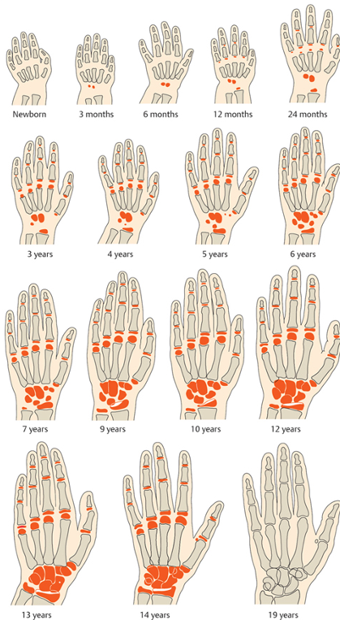
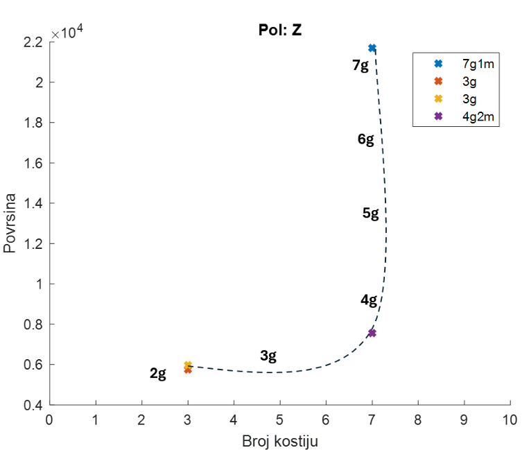
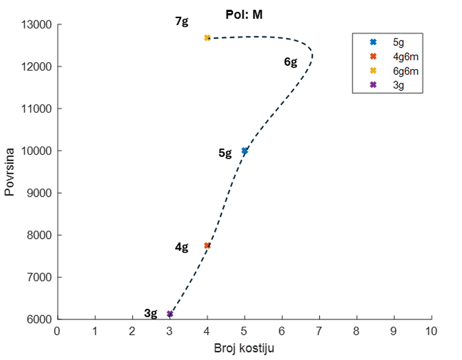

# age-assessment-based-on-radiography

## Overview

In this project I have collaborated with doctors at children's clinic Tirsova to help them with assessment of a patient age based on radiography.
This project implements a machine learning approach for estimating children’s chronological age based on radiographs of hand and wrist bones. The model analyzes key skeletal features to predict age, assisting pediatric assessment in clinical and forensic applications.

## Motivation

Accurate assessment of a child’s age is important for:
- monitoring growth and development
- diagnosing endocrine or skeletal disorders
- forensic and legal purposes (e.g., age estimation when birth records are unavailable)

Traditional manual methods, such as the Greulich-Pyle or Tanner-Whitehouse methods, are time-consuming and prone to inter-observer variability. This project explores automated, data-driven approaches using machine learning.

## Approach

#### 1. Data Preprocessing

- Collected hand/wrist radiographs
- Resized, rotated and normalized images
- Annotated with chronological age

#### 2. Feature Extraction

- Traditional radiographic markers (bone length, shape ratios, eccentricity and circularity of a bone)

#### 3. Model Training

- Regression models to predict age (years/months)

#### 4. Evaluation

- Visualizations of predicted vs actual age

## Technologies
- Python 
- NumPy, pandas
- scikit-learn
- OpenCV / PIL for image processing
- Matplotlib / Seaborn for visualizations

## Limitations
- Dataset size may limit generalization
- Radiograph quality and annotation accuracy affect predictions
- Model performance may vary across populations

## Future Work
- Explore deep learning models for end-to-end age prediction
- Multi-modal data integration (clinical metadata + radiographs)
- Deploy a simple web interface for demonstration
- Compare automated predictions with expert human assessments
